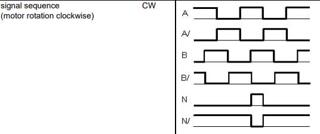

# The Coffee Bot ROS

###TODO 
1. auto-gmapping, in a custom world, with diff drive
 - copy the auto-gmapping nodes (D)
    1. remove unnecessary files (D)
    2. embed the new world for turtlebot (D)
    3. maje sure mapping is good
 - custom control interface 
    1. come up with list of topics, services. 
        - odom: /gazebo -> /sensor_data -> turtle_interface -> /joint_states 
        (-> /tf -> turtlebot3_slam_gmapping -> /map -> /auto_gmapping) -> ekf_odometer -> /odom 
            -TODO: change frame names to match turtlebot. then test this node alone. (Done) 
        - scan: /gazebo -> /scan? (Done)
        - gazebo_in: /cmd_vel -> turtle_interface -> /wheel_cmd -> /gazebo  (Done)
        - Move_base: /odom, /tf, /scan, /move_base_simple/goal, /map -> move_base -> /cmd_vel
        - turtlebot: /tf, /scan, -> turtlebot -> /map
    2. copy the diff-drive model 
        - change tf: base_link_footprint change it. 
                    
2. amcl and motion planning - using the exisiting map. Tuning
    - change params (keep nuslam)
    - added robot_state publisher
    - Differnt /cmd_vel
    - TODO: need to change turtle_interface and the odom issue!!
        1. check turtlebot3 gazebo plugin, see how /cmd_vel can be transformed there
        2. if no luck, check the slam node. 
        3. check the Slam node, see what sensor info is needed here.  
        
        1. **make gazebo read frequency.** 
         

2. change Gazebo plugin, so it will read pwm properly. 
    - right now: move_base -> turtle_interface -> gazebo_plugin. 
    now, given that the definition of /cmd_vel in move_base is strictly velocity, not "twist", we want: pwm = (speed/max_speed) * max_pwm, 
    then in the plugin, position = (pwm/max_pwm) * max_speed * time. 
    - What you need to change: 
        1. turtle_interface: /cmd_vel call back for pwm, changed it to the non-frequency-related way 
        2. plugin: read max_pwm, timer  (Done), **there's a bug in gazebo plugin about theta_r, theta_l! Also, in the plugin, you're updating the speed, Not the position. Gazebo does not provide position?** 


3. Build IMU node
    - Now we need to add another plugin for IMU. follow tutorial for that
        1. Do we need wheel joint info for /gmapping? no, so you just need IMU data to publish tf in turtle_interface.  
        Add 
            - add the gazebo plugin, 
            - test with gazebo only. - Done, **Gazebo IMU plugin seems to be worse than ROS's IMU plugin!**
    - What we need: 
        2. Incorporate robot_ekf package - needs transform: /map -> /odom -> /base_link. 
            - check if gmapping is printing /map -> /odom? (yep)
            - make sure the robot_pose_ekf prints out /odom -> /base_link.  
            - make sure /base_link -> /scan and /base_link -> /base_footprint tf is statically transformed. and the name matches the scan msg header. (/base_scan)
                But still no updates? embed probes in: imuCB, braodcaster. 
                - k, It needed gps and I added a hack so that it does not need GPS. but still, no imu data?  
                velocity?
                Nope, you need velocity and pose.  
            - Test with keyboard and movevbase. (okay)  
            - **Build an "odometer" from IMU**
                1. Angular velocity w is readily available, but you have to 
                
3. clean up
    - 1. Delete the sensor_msgs in this project (Done, didn't delete it since we might need encoder in the future, but this is gonna be cool!)

### Install Ubuntu 18.04 Server and ROS 
**NOTE: AS OF OCTOBER 2020, Raspberry Pi does not provide Ubuntu 18.04 Server anymore. So use this section as are reference, but you may consider using ROS Noetic.**
1. install linux and ubuntu 18.04 server 
 - get sd card reader, sd card, raspberry pi 4. If no HDMI during boot up, and the red light is not on, try adjusting the SD card position
 - Now for some reason, There is very very limited functionalitites in this Ubuntu core 18 server, (no sudo apt, no nothing.)
 - **So I am trying to burn the OS image this again.**
    1.  Download Ubuntu 18.04 from [here](https://ubuntu.com/download/raspberry-pi/thank-you?version=18.04.5&architecture=arm64+raspi4). Then used disk_manager to install it. 
    2. reset ubuntu password: default login name and passwords are both ubuntu.
    3. wifi configuration: 
        go to /etc/netplan, add the wifis part [in this file](https://gist.github.com/dbaldwin/fa1baac11b0ae2f000092b695c3d0b33) to 50-cloud-init.yaml
    4. ssh configuration
        - Set up ssh: 1. delete your old sshkey for the same ip address: ```ssh-keygen -R "you server hostname or ip"```, then just do  ```ssh name@ip```
        - See if you can ssh without ubuntu server being logged in . Yes.
        - change the hostname to "coffeebot@coffeebot001" see [here](https://askubuntu.com/questions/659454/how-to-safely-change-username-and-hostname)
        - make login passwordless: https://www.tecmint.com/ssh-passwordless-login-using-ssh-keygen-in-5-easy-steps/
    5. command search by starting keywords
        
2. Install ROS. [Good video](https://www.youtube.com/watch?v=Irko6xb2qjs)

3. If you accidently deleted everything on your root like I did at one point, don't panic, try to restore them. Right now Raspberry Pi
Does not have Ubuntu 18.04 anymore.
 - everything in /etc/skel
 - change ownership of the username, so you can make changes to files as the account owner```chown -R USER_NAME /home/USER_NAME```
 - add .inputrc for keyword preferences 
     ```
        "\e[A":history-search-backward
        "\e[B":history-search-forward
    ```
 - add SSH again. [See here](https://www.tecmint.com/ssh-passwordless-login-using-ssh-keygen-in-5-easy-steps/)
 - install ROS in step 2
 
 6. on SSH, if you want to reboot, use sudo:  ```$sudo reboot```

#### Execute Wheel Velocity Commands
First, we have ```wheel_vel_executioner``` that carries out wheel velocity commands in (m/s). 

#### Use Wheel Encoders for Localization
After a lot of experiment with the IMU, I found out that IMU does not provide very good accuracy for linear velocities. After consulting with my professor [Dr.Matt Elwin](https://robotics.northwestern.edu/people/profiles/faculty/elwin-matt.html) 
at Northwestern, I decided that wheel encoders are the best way to increase localization accuracy. 

Mounting encoders to a standalone motor is difficult - if your motor shaft is long enough, you can choose an optical encoder. If not, then buying motors with mounted Hall-Effect
quadrature encoder is the best bet. Having done some thorough search on Google, we found [the same 370 Motor but also comes with a wheel encoder](https://www.dfrobot.com/product-1462.html). 
I did some testing, and the motors and their encoders work seamlessly!

Next, we have ```wheel_encoder_publisher``` that reads encoder ticks and convert them into wheel velocities in(m/s)
 - [Here](https://howtomechatronics.com/tutorials/arduino/rotary-encoder-works-use-arduino/) you can find a nice explanation of how a quadrature rotary encoder works. 
The motor manufacturer did not provide the encoder signal sequence, but after some testing, the encoder seems to be coherent with
 the regualr phase A, B convention, see below. (image credit: https://www.rs-online.com/designspark/detecting-quadrature-encoders-with-arduino-uno)
 
    
 - **An important note is that RPi.GPIO has other functions on Pin7 (BCM mode) as pointed out [here](https://www.raspberrypi.org/forums/viewtopic.php?t=205327). 
 So we read encoder interrupts on other pins.**
 
 - We can use spare inputs on the [Yahboom 4WD Expansion Board](https://raw.githubusercontent.com/YahboomTechnology/RaspberryPi-4WD-Car/master/5.SCH/4WD%20expansion%20board%20manual.pdf)
for reading encoder ticks. The reason is they are directly connected to Raspberry Pi's input pins. I'm using two infrared light sockets meant for line following.   

##### Field Test Notes 
Time to test our motors and encoders to see how good they are! 
A simple test plan is 
 1. Mark the starting position: 
 2. Manually rotate the wheel by say 30 revolutions, measure the error.  
- Tests show that the accumulative error is around 2.25 degrees/revolution. 
- If all of a sudden your encoder "freezes", check the electrical connections first. I am taping my wires at the bottom 
of the chassis, and that might caused some connection issues. An indicator is the green LED on the encoders.  


#### Finally, Let's build an Interface on Coffeebot
Now, it's time to implement a ```coffeebot_interface``` to execute wheel velocity commands from the upstream controllers, then publish wheel encoder messages.


### Control Interface 
In the control interface, we need:  
 - a spinner that read the msg with time stamps, then Update the robot pose. 
 - publishes intended wheel velocity commands in m/s. 


### Connect to the Coffebot
1. SSH into the coffeebot, replace coffeebot with the username on Raspberry Pi   ```$ssh coffeebot@192.168.1.29 ```
2. copy files to the Coffeebot ```$rsync -av FOLDER_NAME coffeebot@192.168.1.29:/home/coffeebot/FOLDER_NAME```. Note that this will copy everything inside the 
 folder to the home directory. Therefore, ```--delete ``` will delete everything else in the current home direcotry.
 This is **Very Dangerous, and you may accidently delete everything on your home directory.**
3. Launch the launch file on your local computer
    - **Note that I recommend opening rqt_console to see debug messages, I haven't found a way to print regular msgs to screen remotely **  


### Future Improvements
1. There might be a better way to detect slipping of the wheels. Maybe my with a different set of settings, my IMU can provide more accurate
 linear accleration measurements, so we might be able to use that for detecting wheel slipping.  
2. When I was setting up the interrupt-driver encoder reader, I had a hard time with an error: "RPi.GPIO: failed to add edge detection"
I tried these methods, then I rebooted the system. It started working: 
    - change owner of RPi.GPIO 
    - follow this link to make a group called "GPIO", make a udev.rules called ```99-raspberrypi.rules```, then reload it ```$udevadm control --reload-rules```. 
    - when specifying input pins, I added the pull_down option 
    ```GPIO.setup(Left_Phase_A,GPIO.IN, pull_up_down=GPIO.PUD_UP)```
    - rebooting the Raspberry Pi
    - It'd be interesting to explore how Udev works in the future. Right now I'm not entirely sure!

###REAL ROBOT STUFF
1. configure IMU, 
    - Download Method 1 (**not recommended**): follow this [example carefully](http://wiki.ros.org/phidgets). 
        1. **Make sure you copy the udev rules to phidget.**
        2. Install sound_play from apt-get 
        3. if you run into issues with opencv2, follow [here](https://answers.ros.org/question/65892/rosmake-error-rospack-error-packagestack-depends-on-non-existent-package-opencv2/)
        4. you also need to download phidgets21 library [here](https://www.phidgets.com/docs/OS_-_Linux)
        5. You may want to delete unncessary packages in CMakeList.txt as they require boost
    - Download Method 2 (**Recommanded**)
        1. come download the IMU driver directly: http://wiki.ros.org/phidgets_imu
        2. configure parameters.  (do not remap topics here)
    - Download imu_madgwick filter. 
        0. test its /tf is good. If so, in launch file disable our own tracker. 
        1. remap topic to from imu_data to /imu_data
        
2. configure Lidar 
    - lidar will be **downward facing** (CW)
    - installation, using SilliconLab CP210x. First, build the driver as shown here http://headstation.com/archives/instructions-installing-cp210x-serial-bridge-driver/
     Then, use a **GOOD USB Cable for connection**.  
    I like to fix my usb connection to ttySLAB0, so I followed [here](https://www.silabs.com/community/interface/knowledge-base.entry.html/2016/06/06/fixed_tty_deviceass-XzTf)
    If there are problems, try adding the VID(vendor), PID(Product ID) yourself: vendor id: 10c4, PID: 80a9, ea60, ea61, ea63, from [this website](http://www.linux-usb.org/usb.ids)
    then follow [here](https://www.raspberrypi.org/forums/viewtopic.php?t=160400)

3. The default scan direction of RPLidar A1 is in CW (Clock-Wise). Now I prefer to have it configured to CCW so it's consistent with the right-hand frame.  

6. build a /cmd_vel local node. 
    - build minimal node /coffee_bot/cmd_vel_executioner (that takes in /cmd_vel)
        0. Figure out how to build ROS -> GPIO
        1. then source devel/setup.bash in ~/.bashrc
        2. build a pwm publisher on a local ROS node 
            - pinouts are the same for RPi 3B and 4B
            - If you try to use RPi.GPIO but see an error ```RuntimeError: Not running on a RPi!```
                1. make sure you have downloaded rpi.gpio and gpiozero through pip
                2. **check you're in the dialout group of ```/dev/gpiomem```, as suggested [here](https://github.com/gpiozero/gpiozero/issues/837)
                to change your user group, do ```$sudo chown ${USER} /dev/gpiomem```**
                    - after reboot, the owner of ```/dev/gpiomem```  might still remain root. That is because it is changed by an init program ```udevd```, with high priviledge. 
                    Therefore, you need to **transform your current user into a sudo user [(see here)](https://medium.com/@thucnc/how-to-create-a-sudo-user-on-ubuntu-and-allow-ssh-login-20e28065d9ff), 
                    and you do not [want password](https://www.vpsserver.com/community/tutorials/3926/enabling-sudo-for-your-user-on-ubuntu-17-04-and-centos-7-4/)**: 
                        1. login as root through ssh, [see here](https://www.liquidweb.com/kb/enable-root-login-via-ssh/)
                        2. add ```sudo chown ${USER} /dev/gpiomem``` in a bash file, then source it 
        3. test the pwm publisher with a simple LED circuit. 
    - build cmd_vel_executioner
        1. build the node, with all directions, 
            - Subscribes to nuturtle msgs (how)
            - Provides a speed limit check, scale it down if overspeed.  
            - why do you need spin left, spin right? (it's just kinda redundant. But your PWM is in [0, 100], so indeed you need to specify wheel rotation)
        2. only keep teleop for testing, then cross compile it. 
        3. launch teleop_keyboard, turtle_interface on your machine. test with LED again
            - does not work. Need cross compilation? 
                1. on multiple machines, you need cross-compilation?
            - Launch on Multi-machine
                1. If you see an error ```RLException: remote roslaunch failed to launch```, follow [this great post](https://answers.ros.org/question/187320/remote-roslaunch-failed-to-launch/)
                 also, change permission using chmod +x
                2. If you see an error ```roslaunch not found```, make sure you source ```devel/setup.bash``` the way in the link above
                3. ```export ROS_MASTER_URI=http://192.168.1.11:11311``` #use hostname -I to check local IP
                4. create a bash file for your local nodes. 
                5. on the turtlebot, ```sudo vim /etc/hosts```, then add ```192.168.something Your_Computer_Hostname``` so the computer can know where your computer is 
                6. **Question** If we start launchfile on computer A, but the launch file runs node1 on computer B. Both computer A and B has a version of node 1, which version of node 1 will be run eventually? 
                    - The computer B version. 
                    - so <output="screen">does not work on remote machines? (No it doesn't. You have to use rqt_console, but I didn't figure out a way to do it yet.)
                
7. Connect IMU to it, run IMU basic node. 
    - Build the phidgets library. 
        1. git clone the https version, I didn't set up ssh for github on that computer
            - **DO NOT FORGET TO COPY UDEV RULES AS INSTRUCTRED!**
        2. see if you can build the package. Yep
        3. build the imu_madgwick_filter package 
    - test, then change launch file. 
        1. test with turtle_interface, see if you can see imu info. 
        2. if so, change launchfile, test 
            - remap topics
            - disable tf from imu_madgwick filter
            - set z axis acceleration to 0
    - Simple Drift correction: 
        1. skip IMU readings when wheel_cmd is 0. **Note call /imu/calibrate repetitively does not solve the issue, as it will only correct gyroscope biases.**
        2. disabling magnetometer indoors helps. **Why?**
    - IMU: make sure IMU has the right orientation
        1. if inverted is false for the imu node, axis 1 is -y, axis 0 is -x.
        2.  I can figure out the + axes by: setting a low IMU speed, have gravity, and tilt the IMU. 
        3. having a level surface is important: as you don't want x to have gravity.  
        
    - **Detrimental: this IMU (Phidgets 1042_B) has really low resolution: 1cm/s^2. Without wheel encoder, Indoor IMU usually has low accuracy**
        1. To counter that, deactivate IMU.
        2. add "coarse_odom" from /cmd_vel. 
            - appears to be working!
             
        
8. Mount Lidar to it, run with Lidar
    - build the lidar lib(Done)
    - create portable udev rules so Lidar is always/dev/ttySLAB0[follow here](https://www.silabs.com/community/interface/knowledge-base.entry.html/2016/06/06/fixed_tty_deviceass-XzTf)  
        1. Port it to /etc/udev/rules.d or /etc/udev/rules, depending on your distro
    - tune some parameters
        1. Change usb /dev/ttySLAB0
        2. Change its output frame to /odom
    - figure out how to mount it. 
        1. The orientation of the lidar 
        

10. Final assembly
    - Test with the whole system
        1. open rviz, adjust its orientation so lidar is guut
        2. add in turtle_interface, gmapping
    - take the circuits apart.  
    - test with the motor circuits        
        1. measure travel distance with a script, which uses the PWM in 1s. 
        2. use teleop (here **install universal_teleop package** )
    
    
### Question
1. meta-package? nu
2. Why don't I need joint_states for TF? 
3. Do we need to set these in move_base stack? global_costmap/robot_base_frame